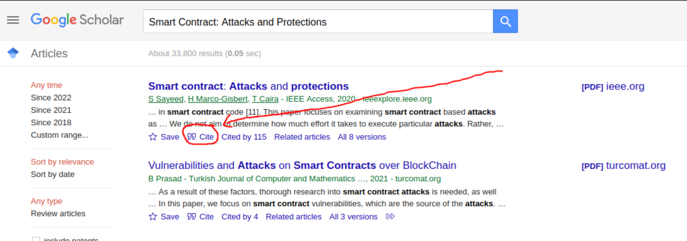

# TCC

Template criado para simplificar a sua vida na hora de fazer TCC com LaTeX tudo no Ubuntu, Git e VSCode, adeus Overleaf!

### Notas sobre o uso deste template

Este template esta em ingles. Para alterar, voce tera que fazer manualmente.

Sobre as normas de ABNT: Nao conheco elas, ate onde eu sei esse template nao segue nenhuma norma. Tera que fazer isso por conta propria.

Lembre-se de fazer seu repositorio deste template **-> PRIVADO <-** para evitar plagio!

## Setup

**Para instalar dependencias**: `make install-deps`

Instale os plugins recomendados do VSCode (LaTeX e LaTeX Workshop), eles permitem que o pdf seja regerado toda vez que voce salva um arquivo `.tex`.

## Uso

Este template foi feito para VSCode, entao vamos assumir que este eh seu ambiente.

Basta abrir um arquivo LaTeX com setup finalizado, alterar e salvar para alteracoes serem aplicadas.

Para visualizar em tempo real as atualizacoes, clique no icone indicado:


*Se nao encontrar este icone, verifique que o LaTeX Workshop foi instalado!*

### Comandos:

**Para gerar pdf no CLI**: `make all`

**Para limpar arquivos temporarios**: `make clean`

## Dicas

### Como comecar?

Tudo padronizado que precisa do seu input foi prefixado com `TODO:` + uma descricao.

Portanto, comece dando `CTRL+F` e preenchendo todos os `TODO`s ;)

### Como adicionar referencias?

1. Entra no [Google Scholar](https://scholar.google.com/)
2. Cole o nome da sua referencia
3. Clique em 'Cite'


4. Clique em 'BibTeX'


5. Copie o texto da pagina, exemplo:
```

@article{sayeed2020smart,
  title={Smart contract: Attacks and protections},
  author={Sayeed, Sarwar and Marco-Gisbert, Hector and Caira, Tom},
  journal={IEEE Access},
  volume={8},
  pages={24416--24427},
  year={2020},
  publisher={IEEE}
}

```
6. Cole em `bibliografia.bib`
7. Copie o titulo da referencia. O nome da referencia anterior seria `sayeed2020smart`
8. Referencie no texto escrevendo, por exemplo: `\cite{sayeed2020smart}`